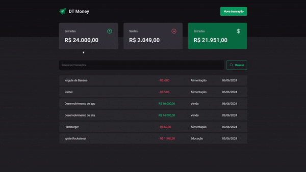
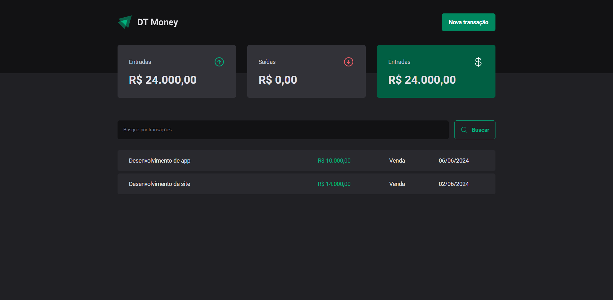
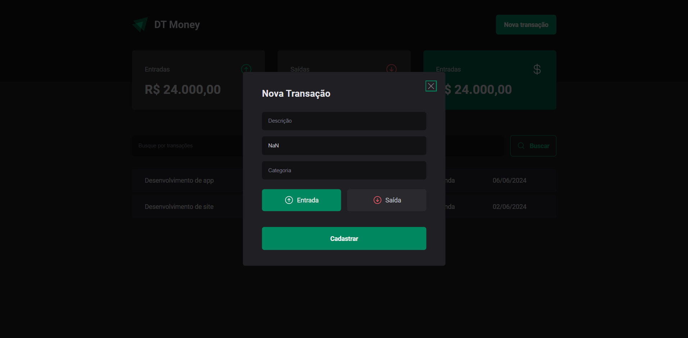

<p align="center" >

</p>
<h1 align="center">
    Dt-Money
</h1>

<h2 align="center"> Aplicação Rocketseat Dt-Money 💵 </h2>

<h2>📷 Preview </h2>
<h1 align="center">
  <div style="display: flex; flex-direction: row;">
    
  <div>
</h1>

<h1 align="center">
  <div style="display: flex; flex-direction: row;">
    
</h1>

<h1 align="center">
  <div style="display: flex; flex-direction: row;">
    
  <div>
</h1>

O Dt-Money é um projeto desenvolvido no curso de ReactJS da Rocketseat. 

<h2 id="technologies"> 🛠 Tecnologias utilizadas: </h2>

- [TypeScript](https://www.typescriptlang.org/)
- [React](https://pt-br.reactjs.org/)
- [Vite](https://vitejs.dev/)
- [Phosphor Icons](https://phosphoricons.com/)
- [React Hook Form](https://github.com/react-hook-form/react-hook-form)
- [Styled-Components](https://styled-components.com/)
- [Zod](https://github.com/colinhacks/zod)
- [RadixUI](https://www.radix-ui.com/)
- [JSON Server](https://www.npmjs.com/package/json-server)
- [Use Context Selector](https://github.com/dai-shi/use-context-selector)
- [Axios](https://axios-http.com/ptbr/docs/intro)
- [ESLint](https://eslint.org/)

```bash
# Clone Repository
$ git clone https://github.com/ThiagoYamaguchi/dt-money.git

# Go to server folder
$ cd dt-money

# Install Dependencies

$ npm install

$ npm run dev

$ npm run dev:server
```